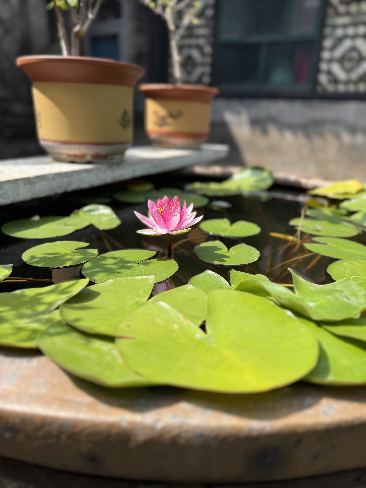

Rozdzial 1
==========

Chiny to panstwo o niezwyklej historii, kulturze i dynamice rozwoju.  
Od czasow starozytnych cywilizacji nad rzeka Huang He po wspolczesne megamiasta, kraj ten stanowi fascynujace polaczenie **tradycji i nowoczesnosci**.  

Na przestrzeni wiekow Chiny inspirowaly filozofow, wynalazcow i artystow.  
To tutaj powstaly papier, proch, kompas i druk – cztery wynalazki, ktore odmienily losy swiata.  
Dzis Panstwo Srodka jest nie tylko ekonomiczna potega, ale takze centrum nauki, kultury i technologii, ktore w coraz wiekszym stopniu ksztaltuje globalna rzeczywistosc.
------------------------------------------------------------------------------------------------------------------------------------------------------------------------

Historia Chin siega tysiecy lat i obfituje w okresy wielkiej potegi, reform, ale tez wojen i przemian.  
Zachowane kroniki opisuja cywilizacje sprzed pieciu tysiecy lat, ktorych wplywy sa odczuwalne do dzis.

Najwazniejsze dynastie chinskie:

* **Dynastia Xia (ok. 2100–1600 p.n.e.)** – poczatek organizacji panstwowej i rolnictwa,  
* **Dynastia Zhou (1046–256 p.n.e.)** – rozwoj filozofii konfucjanskiej i taoistycznej,  
* **Dynastia Han (206 p.n.e.–220 n.e.)** – rozkwit kultury, nauki i ekspansji Jedwabnego Szlaku,  
* **Dynastia Tang (618–907)** – zloty wiek literatury i sztuki,  
* **Dynastia Ming (1368–1644)** – epoka eksploracji i budowy Wielkiego Muru,  
* **Dynastia Qing (1644–1912)** – ostatnia cesarska dynastia, zakonczona upadkiem monarchii.

Wielki Mur Chinski, liczacy ponad 20 000 kilometrow, stal sie symbolem determinacji i organizacji narodu.  
Jego budowa trwala setki lat i angazowala miliony robotnikow.  

Chinska cywilizacja od zawsze laczyla praktyczne podejscie do zycia z gleboka duchowoscia.  
Filozofie takie jak **konfucjanizm**, **taoizm** i **buddyzm** uksztaltowaly spoleczne wartosci, hierarchie i podejscie do natury.  
Konfucjusz glosil zasady moralnosci, lojalnosci i harmonii, ktore do dzis stanowia fundament chinskiego spoleczenstwa.

